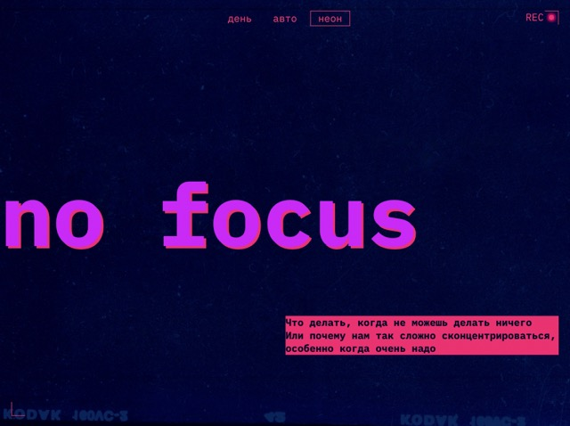

# Это учебный проект для Яндекс Практикум

Третья проектная работа по направлению Фулл-стак разработчик на платформе Яндекс Практикум. Pixel-perfect верстка по макету из фигмы с акцентом на адаптивный дизайн.

Ссылка для автотестов:
https://github.com/konopat/slozhno-sosredotochitsya.git
